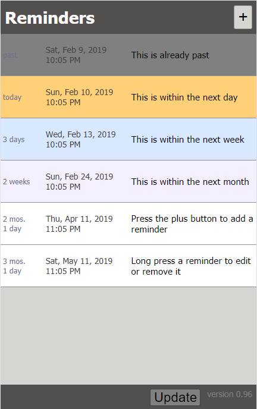

# Reminder PWA

#### By **Phil Mass**

## Description

_This progressive web app keeps track of a user's upcoming events in a list, with the ability to add, edit, or delete events. The background color indicates how soon the event is from the current date. It is intended as a simpler alternative to a calendar. You can scroll through and edit events with either touch or a mouse._

_Because it conforms to the progressive web app (PWA) standard, it can be installed like a native app on Android phones. The PWA standard describes web apps that are optimized for mobile and can work offline_

_You can see the deployed app and install it on your phone [here](https://philrmass.github.io/reminder-pwa/)._

## Setup And Installation

* Git clone the repository at https://github.com/philrmass/reminder-pwa.git to a local directory
* Open index.html in a browser

## Known Bugs

_PWA installation doesn't work on iPhones_

## Support and Contact Details

If you have any issues or questions, please email me at philrmass@gmail.com

## Legal

Copyright (c) 2019 Phil Mass

This software is licensed under the MIT License

